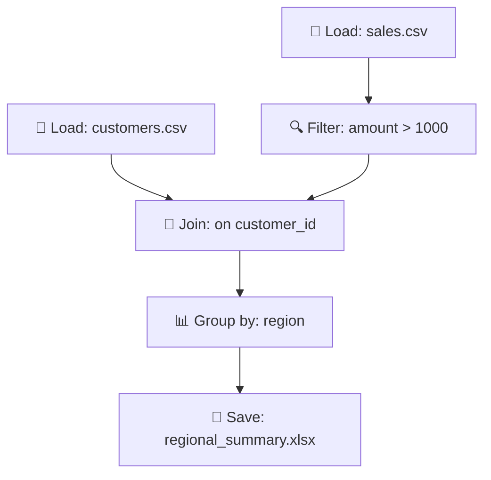

# Alterwise

Convert Alteryx workflows to Python code using AI. A secure, fast, and reliable tool for data professionals transitioning from Alteryx to Python.

## 🚀 Features

- **Upload CSV/Excel files** - Drag & drop or browse to upload data files
- **Natural language processing** - Describe your workflow in plain English
- **Secure code generation** - AI generates safe, executable Python scripts
- **Visual workflow diagrams** - See your data pipeline as a Mermaid diagram
- **Instant download** - Get your Python script ready to run
- **Security-first design** - Input validation, file size limits, and secure API calls

## 🛡️ Security Features

- **Input validation** - All user inputs are validated and sanitized
- **File type restrictions** - Only CSV and Excel files accepted
- **Size limits** - 10MB maximum file size, 5000 character limit for descriptions
- **Script validation** - Generated Python code is checked for dangerous operations
- **CORS protection** - Proper cross-origin resource sharing configuration
- **Content Security Policy** - XSS and injection attack prevention
- **Request timeout** - 30-second timeout prevents hanging requests

## 🏗️ Tech Stack

- **Backend**: FastAPI, Anthropic Claude API, Python
- **Frontend**: React 18, Vite, Axios, Mermaid.js
- **Deployment**: Vercel (both frontend and backend)
- **Security**: Input validation, CSP headers, file restrictions

## 📁 Project Structure

```
alterwise/
├── backend/
│   ├── knowledge/
│   │   └── alteryx_mapping.py     # Alteryx to Python knowledge base
│   ├── api/
│   │   └── generate.py            # FastAPI endpoints with security
│   ├── requirements.txt           # Python dependencies
│   └── vercel.json               # Backend deployment config
├── frontend/
│   ├── src/
│   │   ├── App.jsx               # Main React component
│   │   ├── App.css               # Styles with responsive design
│   │   ├── main.jsx              # React entry point
│   │   └── index.html            # HTML template with security headers
│   ├── package.json              # Node.js dependencies
│   ├── vite.config.js            # Build configuration
│   └── vercel.json               # Frontend deployment config
└── README.md                     # This file
```

## 🔧 Local Development

### Prerequisites

- Python 3.8+
- Node.js 16+
- Anthropic API key

### Backend Setup

```bash
cd backend
pip install -r requirements.txt
export ANTHROPIC_API_KEY=your_api_key_here
uvicorn api.generate:app --reload --port 8000
```

### Frontend Setup

```bash
cd frontend
npm install
echo "VITE_API_URL=http://localhost:8000" > .env
npm run dev
```

Open http://localhost:5173

## 🚀 Deployment to Vercel

### Backend Deployment

```bash
cd backend
vercel login
vercel --prod
```

After deployment, add your API key:
```bash
vercel env add ANTHROPIC_API_KEY
# Enter your Anthropic API key when prompted
```

### Frontend Deployment

1. Update `frontend/vercel.json` with your backend URL:
```json
{
  "rewrites": [
    {
      "source": "/api/:path*", 
      "destination": "https://your-backend-url.vercel.app/api/:path*"
    }
  ]
}
```

2. Deploy:
```bash
cd frontend
vercel login
vercel --prod
```

## 📖 Usage Guide

### 1. Upload Data Files
- Drag and drop CSV or Excel files (max 10MB each)
- Supported formats: `.csv`, `.xlsx`, `.xls`
- Multiple files supported for joins and unions

### 2. Describe Your Workflow
Describe what you want to do in plain English. Examples:

- **"Filter sales > $1000, join with customers on customer_id, calculate total by region"**
- **"Remove duplicates, fill missing values, export to Excel"**
- **"Combine all CSVs, sort by date, calculate monthly totals"**

### 3. Generate & Download
- Click "Generate Python Script"
- Review the workflow diagram
- Copy or download the Python script
- Run it locally with your data

## 🔍 Example Workflow

**Input**: "Load sales.csv, filter for amounts over $1000, join with customers.csv on customer_id, group by region, and save to Excel"

**Generated Code**:
```python
import pandas as pd
import numpy as np
from pathlib import Path

# Configuration
INPUT_SALES = "sales.csv"
INPUT_CUSTOMERS = "customers.csv"
OUTPUT_FILE = "output/regional_summary.xlsx"

try:
    # Load data
    print("Loading sales data...")
    df_sales = pd.read_csv(INPUT_SALES)
    print(f"Loaded {len(df_sales):,} sales records")
    
    print("Loading customer data...")
    df_customers = pd.read_csv(INPUT_CUSTOMERS)
    print(f"Loaded {len(df_customers):,} customer records")
    
    # Filter sales > $1000
    df_filtered = df_sales[df_sales['amount'] > 1000]
    print(f"Filtered to {len(df_filtered):,} high-value sales")
    
    # Join with customers
    df_merged = pd.merge(df_filtered, df_customers, on='customer_id', how='inner')
    print(f"Joined data: {len(df_merged):,} records")
    
    # Group by region
    df_summary = df_merged.groupby('region').agg({
        'amount': ['sum', 'count', 'mean']
    }).round(2)
    
    # Save to Excel
    Path(OUTPUT_FILE).parent.mkdir(parents=True, exist_ok=True)
    df_summary.to_excel(OUTPUT_FILE)
    print(f"Results saved to {OUTPUT_FILE}")
    
except Exception as e:
    print(f"Error: {e}")
```

**Generated Diagram**:


## 🧪 Testing

### Backend Testing
```bash
cd backend
python -m pytest tests/ -v
```

### Frontend Testing
```bash
cd frontend
npm test
```

### Security Testing
```bash
# Test file upload limits
curl -X POST -F "files=@large_file.csv" -F "requirement=test" http://localhost:8000/api/generate

# Test input validation
curl -X POST -F "requirement=" http://localhost:8000/api/generate
```

## 🔒 Security Considerations

### Input Validation
- All file uploads are validated for type and size
- User descriptions are sanitized to prevent injection attacks
- Generated Python code is scanned for dangerous operations

### API Security
- Rate limiting (implement in production)
- Request timeouts to prevent DoS
- Comprehensive error handling without information leakage
- Logging for security monitoring

### Frontend Security
- Content Security Policy headers
- XSS protection
- Secure file handling
- Input sanitization

## 🐛 Troubleshooting

### Common Issues

**"API configuration error"**
- Make sure `ANTHROPIC_API_KEY` is set in your environment
- Verify the API key is valid and has sufficient credits

**"File too large"**
- Files must be under 10MB
- Consider splitting large files or using data samples

**"Invalid file type"**
- Only CSV and Excel files are supported
- Check file extension is `.csv`, `.xlsx`, or `.xls`

**"Script generation failed"**
- Check your internet connection
- Verify the description is clear and specific
- Try a simpler workflow description

### Debug Mode

Enable debug logging:
```bash
export LOG_LEVEL=DEBUG
uvicorn api.generate:app --reload --log-level debug
```

## 🤝 Contributing

1. Fork the repository
2. Create a feature branch
3. Add tests for new functionality
4. Ensure all security checks pass
5. Submit a pull request

## 📝 License

MIT License - see LICENSE file for details

## 🆘 Support

- **Issues**: Report bugs and feature requests on GitHub
- **Documentation**: Check this README for setup and usage
- **Security**: Report security issues privately to maintainers

---

**Built with ❤️ using Claude AI • Powered by Anthropic API**